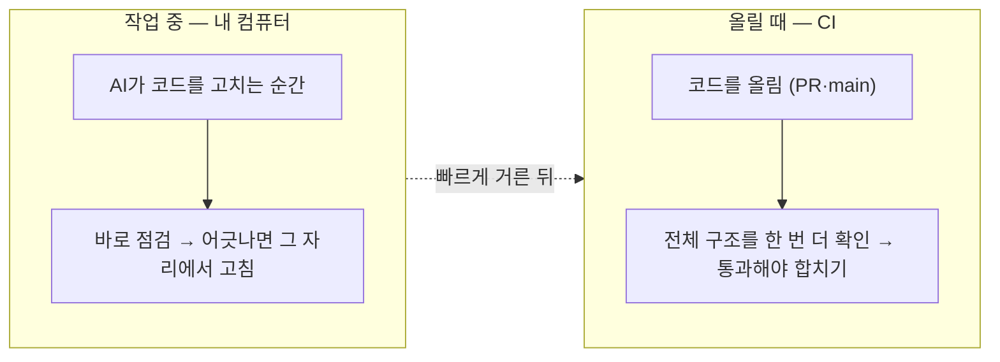
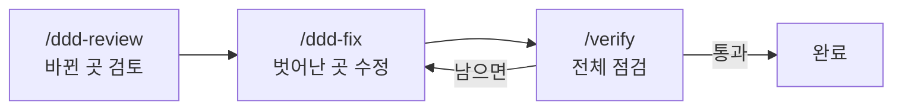
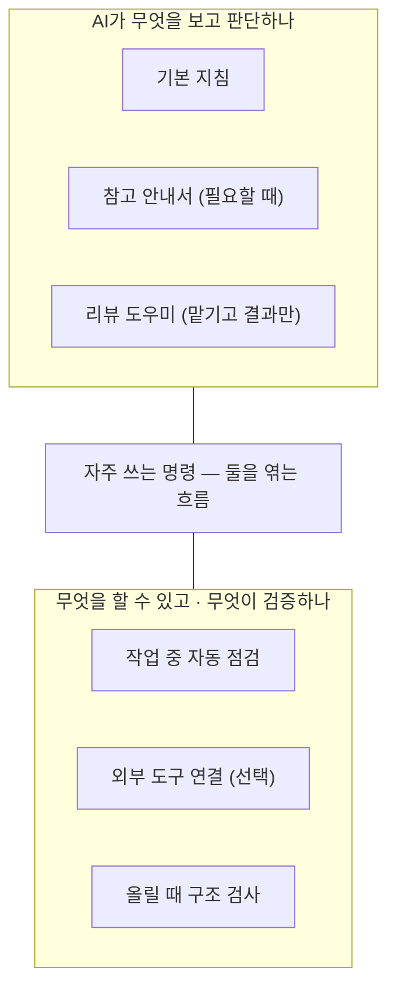
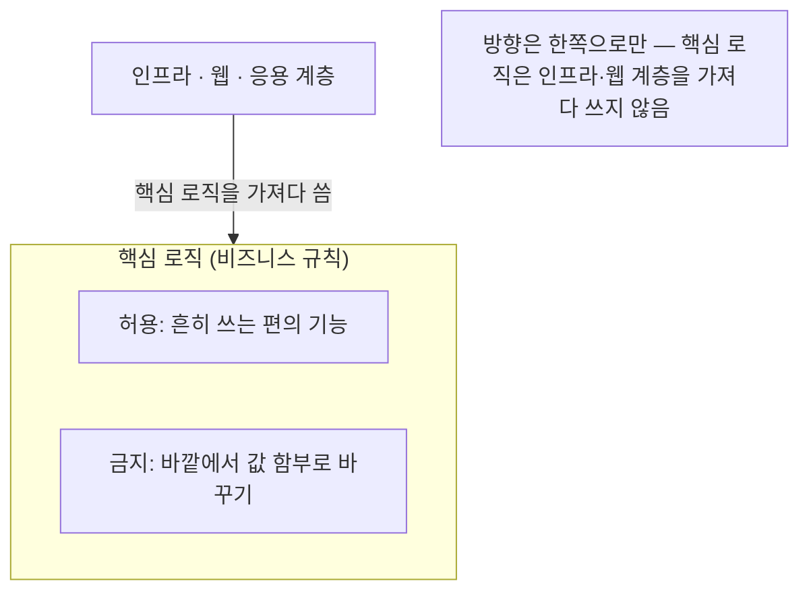

# opinionated-harness-template

AI 에이전트가 짜는 Java/Spring 코드를 DDD(도메인 주도 설계) 원칙에 맞게 잡아주는 가드레일 템플릿이에요. 사람이 매번 리뷰로 걸러내지 않아도, 정해둔 설계 규칙을 벗어나면 그 자리에서 짚어줘요.

이 문서는 템플릿이 무엇으로 이뤄져 있고 어떻게 동작하는지를 한 바퀴 둘러봐요.

 
 

## 한눈에 — 두 곳에서 잡아요

핵심은 간단해요. **코드를 짜는 동안 한 번, 올릴 때 한 번**, 두 곳에서 설계 규칙을 지키는지 봐요.

작업 중에는 AI가 파일을 고치는 순간 곧바로 짚어줘서, 어긋난 코드가 쌓이기 전에 같은 자리에서 고치게 해요. 올릴 때는 사람이 직접 쓴 코드까지 포함해 프로젝트 전체 구조를 한 번 더 확인해요. 한쪽이 놓친 건 다른 쪽이 받쳐줘요.

 
 

## 무엇으로 이뤄져 있나

여섯 가지 장치가 맞물려 돌아가요.

 

**작업 중 자동 점검**

AI가 파일을 고치면 코드를 읽고 벗어난 곳을 그 자리에서 막아 다시 짜게 해요. 그중 규칙이 애매해 잘못 짚을 여지가 있는 검사는 팀 사정에 맞춰 '경고만' 하도록 풀거나 끌 수도 있어요. 함부로 바꾸면 안 되는 파일을 건드리거나 정해둔 방식이 아닌 실행은 아예 일어나기 전에 막고요. 작업을 끝내기 직전엔 빠진 게 없는지 스스로 한 번 점검하게 해요.

 

**올릴 때 구조 검사**

코드를 올리면 프로젝트 전체를 18가지 규칙으로 확인해요. 계층이 흐르는 방향, 묶음(애그리거트) 경계, 값을 함부로 바꾸지 못하게 막았는지, 설계 의도가 잘 지켜졌는지 같은 것들이요. 한 파일만 봐선 안 보이는 문제가 여기서 걸려요. 규칙이 정말 위반을 잡아내는지까지 일부러 어긴 예시로 확인해 둬서, 검사 자체를 믿고 쓸 수 있어요.

 

**설계 의도를 표시하는 여섯 가지 표식**

도메인 모델에 "이건 묶음의 대표", "이건 값 그 자체"처럼 역할을 표식으로 달아둬요. 그러면 점검 장치가 같은 기준으로 규칙을 확인해요.

- **묶음의 대표** — 바깥에서는 항상 이걸 거쳐서만 다뤄요.
- **묶음 안 부품** — 대표를 통해서만 만들어지고, 바깥에서 직접 못 건드려요.
- **값 그 자체** — 한번 만들면 바뀌지 않아요.
- **일어난 사건** — 과거형으로 이름 짓고, 만든 뒤엔 바뀌지 않아요.
- **계산 규칙 모음** — 한 객체에 담기 애매한 규칙을, 자기 상태 없이 입력으로만 처리해요.
- **서브도메인 분류** — 무엇이 우리 서비스의 *핵심*이고 무엇이 *보조·범용*인지 표시해요. 핵심이 흔한 범용 코드에 휩쓸리지 않도록 검사가 지켜줘요.

 

**안내서와 리뷰 도우미**

AI가 필요할 때 꺼내 보는 안내서 네 종류(설계 원칙 · DB 변경 · API · 저장)를 넣었어요. 기계가 딱 잘라 판정하기 어려운, 사람 판단이 필요한 영역은 리뷰 전담 AI에게 맡겨요.

 

**자주 쓰는 흐름을 명령으로**

새 코드를 찍어내는 도구가 아니라, 이미 있는 점검·수정·검증 장치를 순서대로 엮어주는 흐름이에요.

- `/ddd-review` — 바뀐 부분만 골라 검토하고, 규칙을 벗어난 곳 목록을 돌려줘요.
- `/ddd-fix` — 벗어난 곳을 한 번에 하나씩 작게 고친 뒤 다시 확인해요.
- `/verify` — 점검을 한꺼번에 돌리고 결과를 있는 그대로 보여줘요.

 

**외부 도구 연결 (선택)**

AI가 필요할 때 외부 도구나 데이터를 참고하게 해줘요. 기본 예시로는 데이터베이스 구조를 '읽기 전용'으로만 보도록 넣어, 저장 관련 작업을 할 때 실제 구조를 보고 판단하게 했어요. 접속 정보는 환경변수로만 넣고, 비밀번호 같은 값을 코드에 직접 적는 건 금지예요. 기본은 꺼져 있어서 쓰겠다고 켤 때만 동작하고, 안 쓰면 빼도 나머지 점검은 멀쩡히 돌아가요.

 
 

## 두 축으로 보면

위 장치들은 성격이 둘로 나뉘어요. 하나는 *AI가 무엇을 보고 판단하는가*(기본 지침 · 참고 안내서 · 리뷰 도우미), 다른 하나는 *AI가 무엇을 할 수 있고 무엇이 검증하는가*(작업 중 점검 · 외부 도구 · 올릴 때 검사)예요. 자주 쓰는 명령은 이 둘을 잇는 자리에 있고요.

 
 

## 레포에는 뭐가 들어있나

복사해 쓰는 템플릿이라, 폴더가 곧 구성 요소예요. 각각 이런 역할이에요.

| 위치 | 무엇 |
|---|---|
| `.claude/` | 기본 지침, 필요할 때 꺼내는 안내서, 리뷰 도우미, 자주 쓰는 명령, 작업 중 점검 규칙이 모여 있어요. |
| 설계 표식 모음 | 도메인 모델에 역할을 달아주는 여섯 가지 표식이에요. |
| 올릴 때 구조 검사 | CI에서 도는 구조 검사로, 따로 떨어진 모듈이에요. |
| 문서 | 쓰는 법과 구조 검사를 빌드에 연결하는 법을 정리해 뒀어요. |
| 스크립트 | 점검 장치가 제대로 도는지 빠르게 확인해 보는 용도예요. |
| 외부 도구 설정 | 외부 도구를 붙일 때 쓰는 설정이에요. 안 쓰면 그냥 빼면 돼요. |

작업 중 점검 규칙은 한곳에 모아 뒀어요. 더 조이거나 풀고 싶으면 그 설정 한 곳만 고치면 돼요.

 
 

## 너무 빡빡하지 않게

규칙이 지나치게 깐깐하면 오히려 일을 방해해요. 그래서 핵심 로직에서 흔히 쓰는 편의 기능은 허용하고, 바깥에서 값을 함부로 바꾸게 여는 것만 막았어요. 방향은 한쪽으로만 흐르게 해서, 핵심 로직이 인프라나 웹 계층을 거꾸로 끌어다 쓰지 못하게 하고요. 팀 사정에 맞춰 더 조이고 싶으면 설정 한 곳만 손보면 돼요.

 
 

## 알아두면 좋은 점

- 작업 중 점검은 '처음 쓰는 순간'까지 막지는 못해요. 벗어난 걸 돌려줘 다음 차례에 고치게 해요. 사람이 직접 쓴 코드는 올릴 때 검사가 받쳐줘요.
- 정규식으로 어림잡는 검사는 더러 잘못 짚을 수 있지만, 기본은 다 막도록 뒀어요. 특정 검사가 너무 깐깐하면 설정에서 경고로 낮추거나 끌 수 있어요.
- 사람의 맥락 판단이 필요한 원칙(예닐곱 가지: 보편 언어·ACL·얇은 응용 서비스·단일 트랜잭션·상태 전이 등)은 자동 검사 대신 리뷰 도우미에게 맡겨요. 억지로 흉내 내지 않았어요.
- 올릴 때 하는 구조 검사는 프로젝트 빌드에 연결해야 동작해요.

 
 

## 준비물과 문서

작업 중 점검에는 Node.js, 올릴 때 검사에는 JDK 21 이상이 필요해요.
쓰는 법은 [`docs/HARNESS.md`](docs/HARNESS.md), 구조 검사 연결은 [`docs/ARCHUNIT.md`](docs/ARCHUNIT.md)에 정리해 뒀어요.
