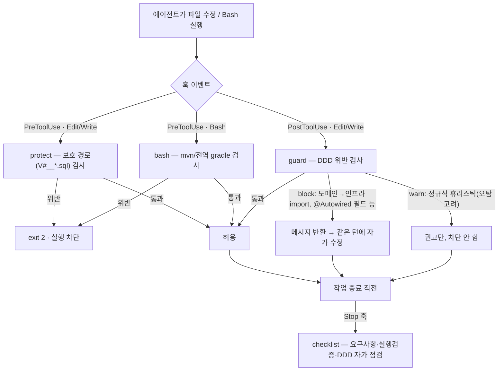
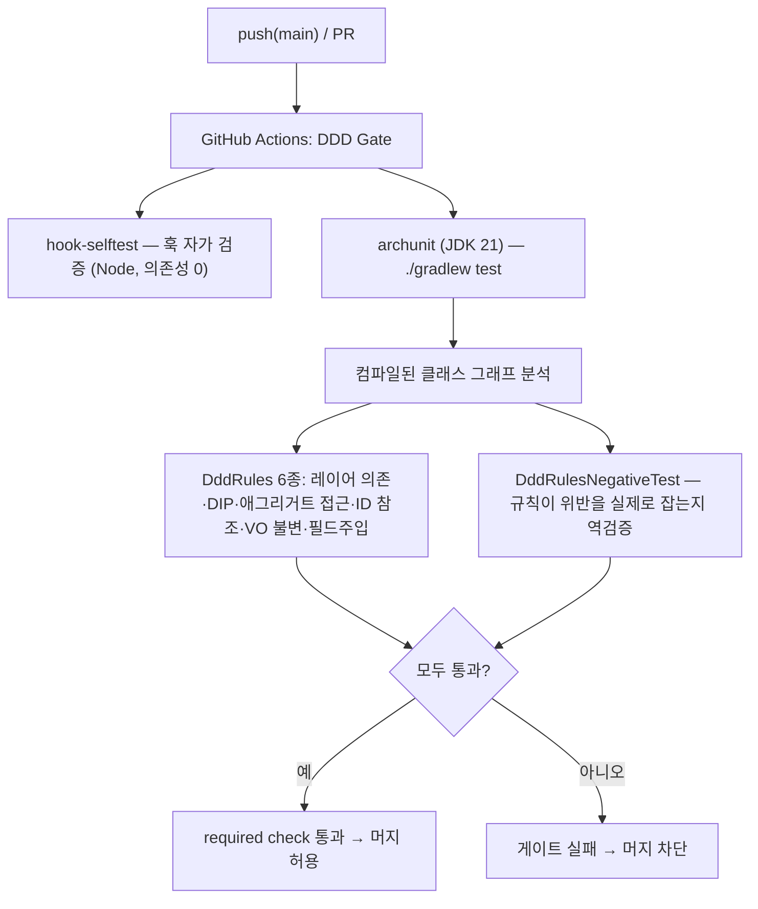
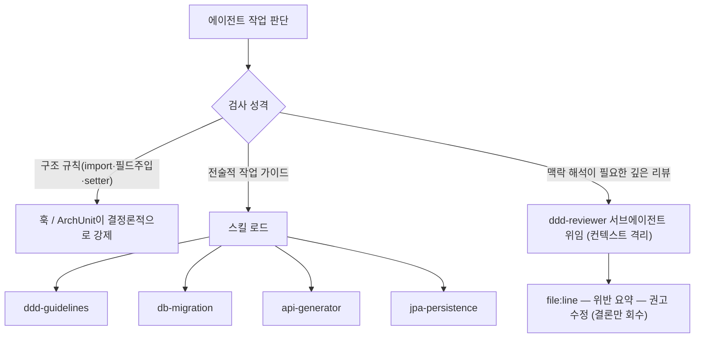
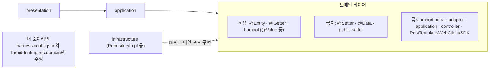

# opinionated-harness-template

AI 에이전트가 짜는 Java/Spring 코드를 DDD 규칙에 맞게 잡아주는 가드레일 템플릿이에요.

변경 사항은 아래 릴리스 노트에서 확인할 수 있어요.

<br>
<br>

## 릴리스 노트

### v0.1.0

`2026년 5월 27일` · 첫 공개 릴리스

로컬 훅과 CI(ArchUnit) 두 곳에서 DDD 위반을 잡는 첫 버전을 공개했어요. `.claude/` 와 `CLAUDE.md` 를
프로젝트에 복사하고 설정 몇 줄만 고치면 바로 쓸 수 있어요.

<br><br>

**`새 기능`  로컬 훅 가드레일**

에이전트가 파일을 고치면 그 즉시 훅이 코드를 읽고 DDD 위반을 짚어줘요. 위반이면 에이전트에게 메시지를
돌려주고, 에이전트는 같은 흐름에서 스스로 고쳐요. 사람이 매번 리뷰로 잡지 않아도 돼요.

- 도메인이 인프라·외부 레이어를 참조하거나, 필드 주입(`@Autowired`)·`@Setter`/`@Data`로 캡슐화를 깨거나, 값 객체를 가변으로 두면 바로 짚어줘요.
- 애그리거트 경계 침범, 다른 애그리거트 직접 참조, 빈약한 모델 같은 건 경고로 알려줘요. 정규식 휴리스틱이라 오탐을 고려해 기본은 막지 않아요.
- 마이그레이션 파일(`V#__*.sql`) 수정과 전역 `mvn`/`gradle` 실행은 실행 전에 막아요(Wrapper 사용 강제).
- 작업을 끝내기 직전엔 자가 점검 체크리스트를 한 번 띄워줘요.



<br><br>

**`새 기능`  ArchUnit CI 게이트**

CI에서 컴파일된 클래스 그래프 전체를 보고 구조 위반을 막아요. 레이어 의존성, DIP, 애그리거트 접근,
ID 참조, 값 객체 불변성을 검사해요. 여러 클래스에 걸친 구조 문제나 훅을 거치지 않은 변경은 여기서 걸려요.

규칙이 진짜로 위반을 잡는지까지 `DddRulesNegativeTest`로 역검증해 둬서, 게이트 자체를 믿고 쓸 수 있어요.



<br><br>

**`새 기능`  공용 마커 어노테이션**

`@AggregateRoot` · `@AggregateInternal` · `@ValueObject` · `@DomainEvent` · `@DomainService` 를 제공해요.
도메인 모델에 이 마커를 붙이면 훅과 ArchUnit이 같은 기준으로 애그리거트·값 객체·이벤트 규칙을 검사해요.

```java
// 마커: com.example.shared.ddd 의 @interface (@Target(TYPE), @Retention(RUNTIME))

@AggregateRoot                       // 애그리거트 루트 — 내부 엔티티는 루트를 통해서만 변경
public class Order {
    private final OrderId id;
    private final List<OrderLine> lines = new ArrayList<>();

    public void addLine(String sku, int quantity) {   // 행위로 불변식 보호 (빈약 모델 금지)
        if (quantity <= 0) throw new IllegalArgumentException("quantity must be > 0");
        lines.add(new OrderLine(sku, quantity));
    }
}

@AggregateInternal                   // 루트 밖에서 직접 접근 금지 (경계 검사 대상)
final class OrderLine {
    private final String sku;
    private final int quantity;
    OrderLine(String sku, int quantity) { this.sku = sku; this.quantity = quantity; }
}

@ValueObject                         // record = 불변 (훅·ArchUnit이 불변성 강제)
public record OrderId(String value) {}
```

<br><br>

**`새 기능`  스킬과 리뷰 서브에이전트**

에이전트가 필요할 때 불러 쓰는 스킬 4종(`ddd-guidelines` · `db-migration` · `api-generator` ·
`jpa-persistence`)을 넣었어요. 자동 검사로 판정하기 어려운 영역은 `ddd-reviewer` 서브에이전트가 리뷰로 맡아요.



<br><br>

**`정책`  실용적 레이어드**

도메인 엔티티의 JPA(`@Entity`)·`@Getter`·Lombok은 허용하고, 가변을 여는 `@Setter`/`@Data`만 막아요.
순수 헥사고날로 더 조이고 싶으면 `harness.config.json`의 `forbiddenImports.domain`만 손보면 돼요.



<br><br>

**`참고`  알아두면 좋은 점**

- 파일 수정 직후 도는 훅(`guard`)은 최초 작성 자체를 막지는 못해요. 위반을 돌려줘 다음 턴에 고치게 해요. 사람이 IDE로 직접 쓴 코드엔 훅이 안 도니, CI의 ArchUnit이 받쳐줘요.
- 경고 규칙은 정규식 기반이라 오탐·누락이 있을 수 있어요. 그래서 기본을 경고로 뒀어요.
- DDD 원칙 중 맥락 해석이 필요한 약 10개는 자동 검사 대신 리뷰 서브에이전트에 맡겨요. 무리하게 흉내내지 않았어요.
- ArchUnit은 대상 프로젝트의 빌드에 연결해야 게이트로 동작해요.

<br><br>

요구사항은 훅 실행에 Node.js, ArchUnit 모듈에 JDK 21 이상이에요.
쓰는 법은 [`docs/HARNESS.md`](docs/HARNESS.md), ArchUnit 연결은 [`docs/ARCHUNIT.md`](docs/ARCHUNIT.md)에 정리해 뒀어요.
