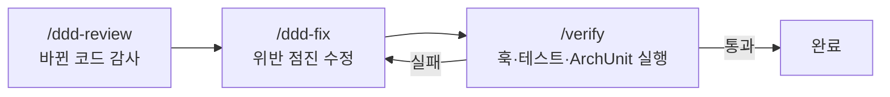
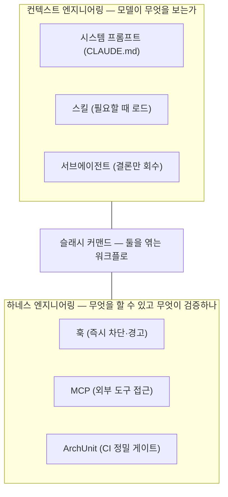
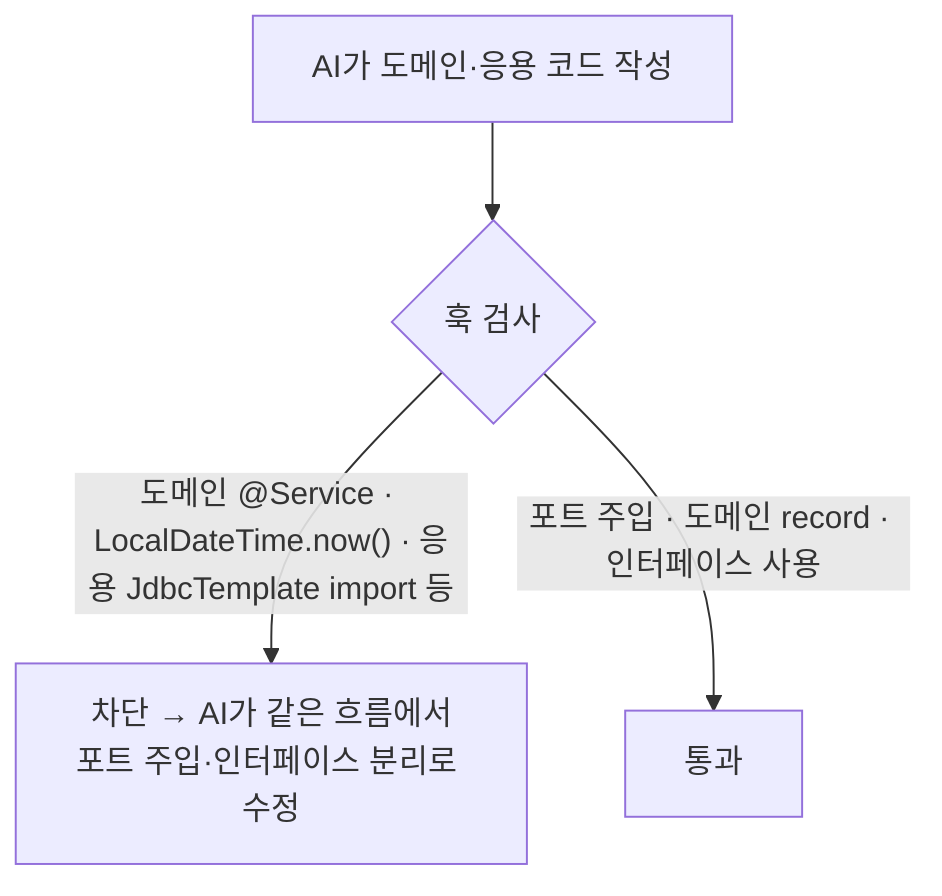
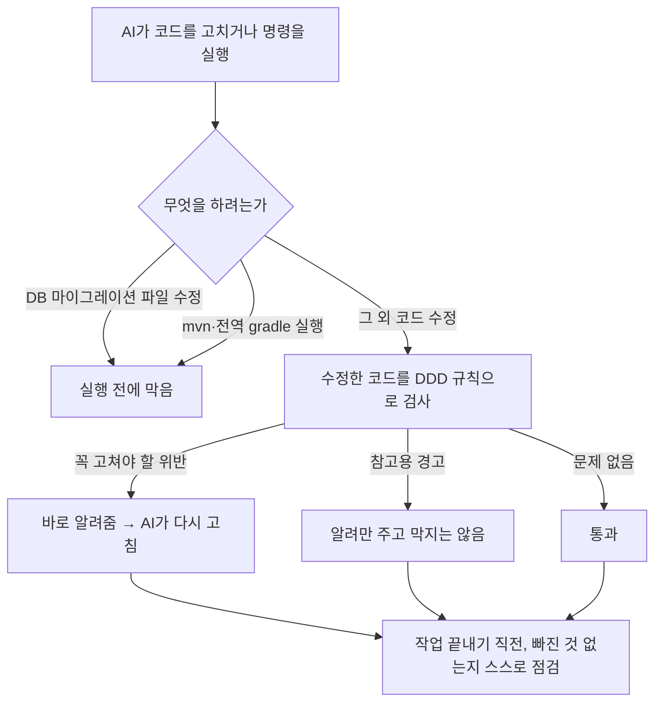
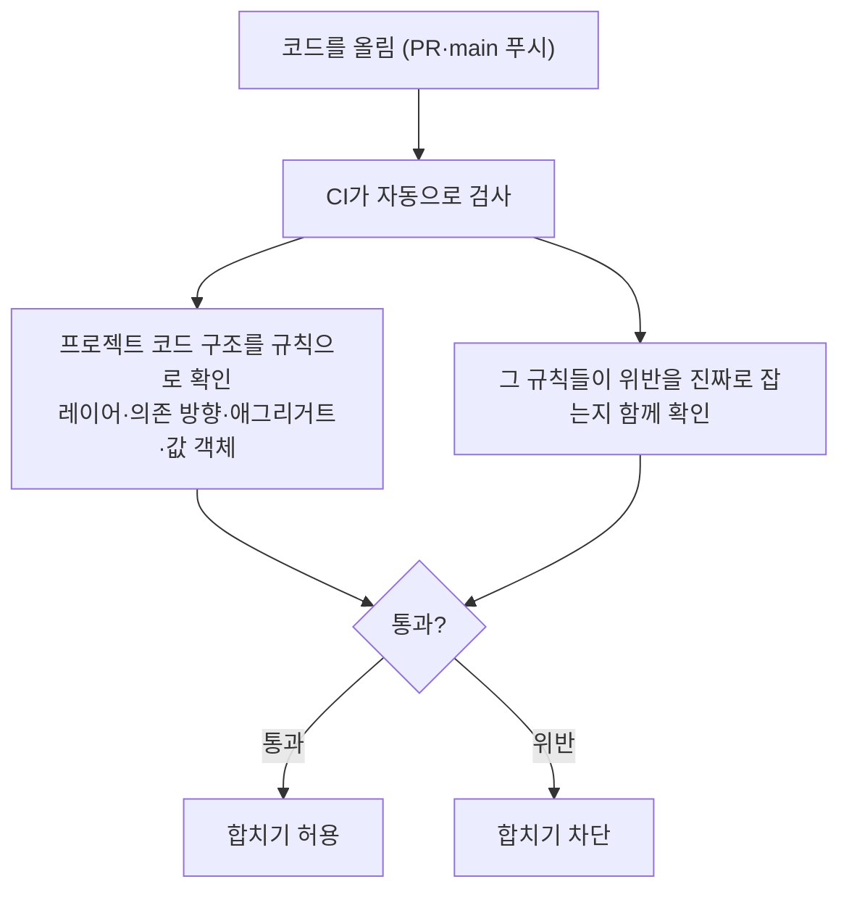
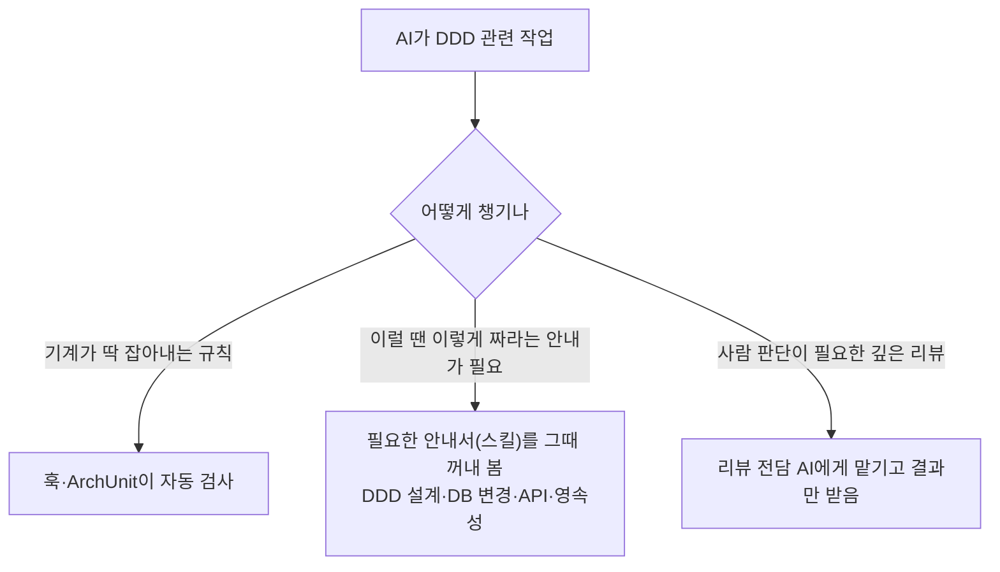
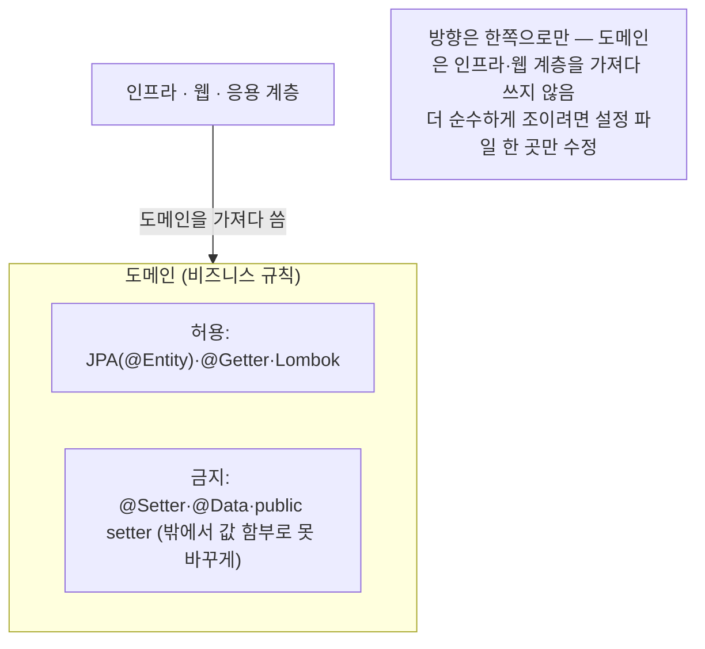

# opinionated-harness-template

AI 에이전트가 짜는 Java/Spring 코드를 DDD 규칙에 맞게 잡아주는 가드레일 템플릿이에요.

변경 사항은 아래 릴리스 노트에서 확인할 수 있어요.

<br>
<br>

## 릴리스 노트

### v0.2.0

`2026년 6월 7일` · 슬래시 커맨드 · MCP · 컨텍스트/하네스 경계

훅과 ArchUnit으로 *막는* 데서 한 걸음 더 나아가, **레버를 엮는 워크플로(슬래시 커맨드)** 와
**외부 도구 접근(MCP)** 을 더하고, 컨텍스트 엔지니어링과 하네스 엔지니어링의 경계를 문서로 정리했어요.

<br><br>

**`새 기능`  슬래시 커맨드 3종**

자주 쓰는 흐름을 커맨드로 묶었어요. 코드를 새로 찍어내는 생성기가 아니라, 이미 있는 레버(서브에이전트·
스킬·훅·테스트)를 엮는 오케스트레이터예요. 그래서 카파시 4원칙이 작업 흐름 자체에 녹아 있어요.

- `/ddd-review [기준]` — 바뀐 파일만 골라 `ddd-reviewer`에게 맡기고 위반 목록만 받아와요(컨텍스트는 깨끗하게).
- `/verify` — 훅 셀프테스트 → `./gradlew test` → ArchUnit을 한 번에 돌리고 결과를 있는 그대로 보고해요.
- `/ddd-fix` — `ddd-guidelines`를 펴고 위반을 최소 단위로 하나씩 고친 뒤 다시 검증해요.



<br><br>

**`새 기능`  opt-in MCP 템플릿**

에이전트에게 외부 도구·데이터를 쥐여주는 하네스 레버예요. 기본으로 `postgres`(읽기 전용 스키마 조회)를
넣어, DB 변경·영속성 작업 때 실제 스키마를 보고 판단하게 했어요.

- 접속 정보는 `${POSTGRES_URL}` 환경변수로만 주입해요. **자격증명 평문 커밋은 금지예요.**
- 프로젝트 `.mcp.json`의 서버는 처음 쓸 때 승인을 물어봐요(기본은 꺼진 상태, opt-in).
- 안 쓰면 `.mcp.json`을 복사 안 하면 돼요. 훅은 Node만으로 돌아가니 MCP 없이도 완전해요.

<br><br>

**`새 기능`  컨텍스트 vs 하네스 경계 정리 + 오픈소스 참고**

레버를 두 축으로 나눠 정리했어요 — **컨텍스트 엔지니어링**(모델이 무엇을 보는가: 시스템 프롬프트·스킬·
서브에이전트)과 **하네스 엔지니어링**(무엇을 할 수 있고 무엇이 검증하나: 훅·MCP·ArchUnit). 슬래시
커맨드는 둘을 잇는 자리에 있어요.

`superpowers`(스킬 점진 공개·커맨드 워크플로)와 `oh-my-codex`(복사-붙여넣기 셋업)의 검증된 패턴을
참고하되, 게이트는 DDD에 맞게 새로 짰어요. 자세한 매핑은 [`docs/HARNESS.md`](docs/HARNESS.md)에 있어요.



<br><br>

### v0.1.1

`2026년 5월 30일` · 도메인 순수성·테스트 가능성 가드 강화

훅 가드레일에 룰 5개를 추가해 도메인이 외부 의존에서 진짜로 분리되게 했어요. 자동으로 잡아주는 DDD 원칙이 16개에서 18개로 늘었어요. AI 에이전트가 학습 데이터에서 본 익숙한 패턴(도메인에 Spring 어노테이션 도배, `LocalDateTime.now()` 직접 호출 등)을 그대로 짜도 그 자리에서 차단해 돌려줘요.

<br><br>

**`개선`  도메인 순수성 가드**

도메인 모델이 Spring 컨테이너나 이벤트 메커니즘에 묶이지 않도록 막아요. 도메인이 framework 없이도 빌드·단위 테스트가 되는 상태가 룰로 강제돼요.

- 도메인 클래스에 `@Service`·`@Component`·`@Repository`·`@Controller`·`@RestController`·`@Transactional` 부착을 차단해요.
- 도메인이 `ApplicationEventPublisher`·`EventBus` 같은 Spring 이벤트 발행자를 import 못 하게 막아요. 도메인은 이벤트를 `record`로 반환만 하고, 실제 publish는 응용 서비스가 해요.

<br><br>

**`개선`  포트 패턴 강제**

응용 서비스가 인프라 구체 타입을 직접 가져다 쓰는 걸 막아요. 인프라 교체(예: JDBC → JPA, AWS → GCP)에도 응용·도메인 코드는 변경되지 않도록 강제돼요.

- 응용 레이어가 `JdbcTemplate`·`RestTemplate`·`WebClient`·AWS SDK·`feign`·`okhttp3` 같은 구체 타입 import를 차단해요.
- 응용은 항상 도메인 Repository 인터페이스 또는 포트로만 인프라에 접근하게 돼요.

<br><br>

**`개선`  도메인 테스트 가능성 가드**

시간과 난수가 시스템에 직접 묶이지 않도록 잡아요. 도메인 규칙을 `Clock.fixed(...)` 같은 결정론적 입력으로 단위 테스트할 수 있는 토대가 만들어져요.

- 도메인이 `LocalDateTime.now()`·`Instant.now()`·`System.currentTimeMillis()` 같은 시간 API를 직접 호출하는 걸 차단해요. `Clock` 포트로 주입받아 쓰세요.
- 도메인이 `new Random()`·`UUID.randomUUID()` 같은 난수/UUID 생성을 직접 호출하는 걸 차단해요. `RandomProvider`·`IdGenerator` 포트로 주입받아 쓰세요.



<br><br>

### v0.1.0

`2026년 5월 27일` · 첫 공개 릴리스

로컬 훅과 CI(ArchUnit) 두 곳에서 DDD 위반을 잡는 첫 버전을 공개했어요. `.claude/` 와 `CLAUDE.md` 를
프로젝트에 복사하고 설정 몇 줄만 고치면 바로 쓸 수 있어요.

<br><br>

**`새 기능`  로컬 훅 가드레일**

에이전트가 파일을 고치면 그 즉시 훅이 코드를 읽고 DDD 위반을 짚어줘요. 위반이면 에이전트에게 메시지를
돌려주고, 에이전트는 같은 흐름에서 스스로 고쳐요. 사람이 매번 리뷰로 잡지 않아도 돼요.

- 도메인이 인프라·외부 레이어를 참조하거나, 필드 주입(`@Autowired`)·`@Setter`/`@Data`로 캡슐화를 깨거나, 값 객체를 가변으로 두면 바로 짚어줘요.
- 애그리거트 경계 침범, 다른 애그리거트 직접 참조, 빈약한 모델 같은 건 경고로 알려줘요. 정규식 휴리스틱이라 오탐을 고려해 기본은 막지 않아요.
- 마이그레이션 파일(`V#__*.sql`) 수정과 전역 `mvn`/`gradle` 실행은 실행 전에 막아요(Wrapper 사용 강제).
- 작업을 끝내기 직전엔 자가 점검 체크리스트를 한 번 띄워줘요.



<br><br>

**`새 기능`  ArchUnit CI 게이트**

CI에서 컴파일된 클래스 그래프 전체를 보고 구조 위반을 막아요. 레이어 의존성, DIP, 애그리거트 접근,
ID 참조, 값 객체 불변성을 검사해요. 여러 클래스에 걸친 구조 문제나 훅을 거치지 않은 변경은 여기서 걸려요.

규칙이 진짜로 위반을 잡는지까지 `DddRulesNegativeTest`로 역검증해 둬서, 게이트 자체를 믿고 쓸 수 있어요.



<br><br>

**`새 기능`  공용 마커 어노테이션**

`@AggregateRoot` · `@AggregateInternal` · `@ValueObject` · `@DomainEvent` · `@DomainService` 를 제공해요.
도메인 모델에 이 마커를 붙이면 훅과 ArchUnit이 같은 기준으로 애그리거트·값 객체·이벤트 규칙을 검사해요.

```java
// 주문(Order) = 하나의 애그리거트. 바깥에서는 항상 Order를 거쳐서만 다룬다.
@AggregateRoot
public class Order {

    private final OrderId id;                       // 주문 번호 (값 객체)
    private final List<OrderLine> lines = new ArrayList<>();

    public Order(OrderId id) {
        this.id = id;
    }

    // 상태를 바꾸는 통로는 이런 "의미 있는 메서드" 하나뿐.
    // setter로 아무 값이나 꽂는 걸 막아, '수량은 1개 이상' 같은 규칙을 항상 지키게 한다.
    public void addLine(String sku, int quantity) {
        if (quantity <= 0) {
            throw new IllegalArgumentException("수량은 1개 이상이어야 합니다");
        }
        lines.add(new OrderLine(sku, quantity));
    }
}

// 주문에 딸린 부품. Order를 통해서만 만들어지고, 바깥에서 직접 못 만든다.
@AggregateInternal
class OrderLine {                                   // public 아님 = 같은 묶음 안에서만 사용
    private final String sku;
    private final int quantity;

    OrderLine(String sku, int quantity) {
        this.sku = sku;
        this.quantity = quantity;
    }
}

// 값 그 자체. record라서 한번 만들면 바뀌지 않는다.
@ValueObject
public record OrderId(String value) {}

// "주문이 접수됐다" 같은 사건 기록. 과거형으로 이름 짓고, 만든 뒤엔 바뀌지 않는다.
@DomainEvent
public record OrderPlaced(OrderId orderId) {}

// 한 객체에 담기 애매한 계산 규칙을 모아두는 곳. 자기 상태 없이 입력으로만 결과를 낸다.
@DomainService
public class ShippingFeePolicy {
    public int feeFor(int totalQuantity) {          // 수량당 1,000원
        return totalQuantity * 1000;
    }
}
```

<br><br>

**`새 기능`  스킬과 리뷰 서브에이전트**

에이전트가 필요할 때 불러 쓰는 스킬 4종(`ddd-guidelines` · `db-migration` · `api-generator` ·
`jpa-persistence`)을 넣었어요. 자동 검사로 판정하기 어려운 영역은 `ddd-reviewer` 서브에이전트가 리뷰로 맡아요.



<br><br>

**`정책`  실용적 레이어드**

도메인 엔티티의 JPA(`@Entity`)·`@Getter`·Lombok은 허용하고, 가변을 여는 `@Setter`/`@Data`만 막아요.
순수 헥사고날로 더 조이고 싶으면 `harness.config.json`의 `forbiddenImports.domain`만 손보면 돼요.



<br><br>

**`참고`  알아두면 좋은 점**

- 파일 수정 직후 도는 훅(`guard`)은 최초 작성 자체를 막지는 못해요. 위반을 돌려줘 다음 턴에 고치게 해요. 사람이 IDE로 직접 쓴 코드엔 훅이 안 도니, CI의 ArchUnit이 받쳐줘요.
- 경고 규칙은 정규식 기반이라 오탐·누락이 있을 수 있어요. 그래서 기본을 경고로 뒀어요.
- DDD 원칙 중 맥락 해석이 필요한 약 10개는 자동 검사 대신 리뷰 서브에이전트에 맡겨요. 무리하게 흉내내지 않았어요.
- ArchUnit은 대상 프로젝트의 빌드에 연결해야 게이트로 동작해요.

<br><br>

요구사항은 훅 실행에 Node.js, ArchUnit 모듈에 JDK 21 이상이에요.
쓰는 법은 [`docs/HARNESS.md`](docs/HARNESS.md), ArchUnit 연결은 [`docs/ARCHUNIT.md`](docs/ARCHUNIT.md)에 정리해 뒀어요.
