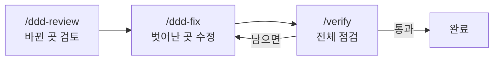
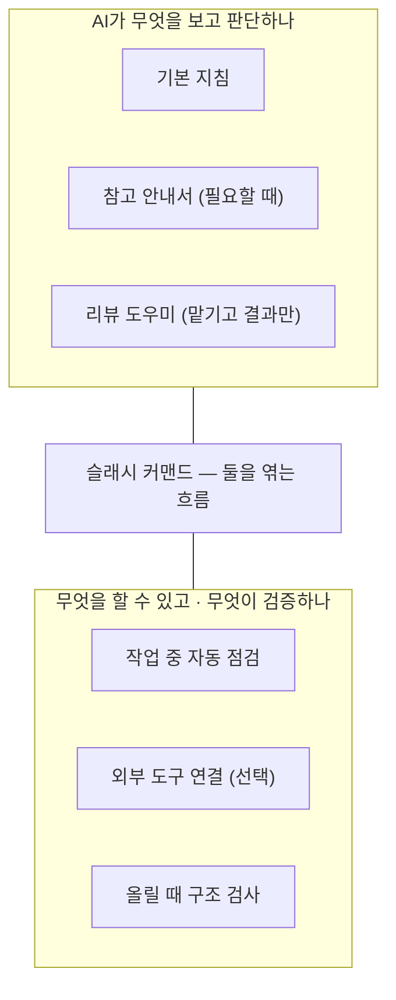
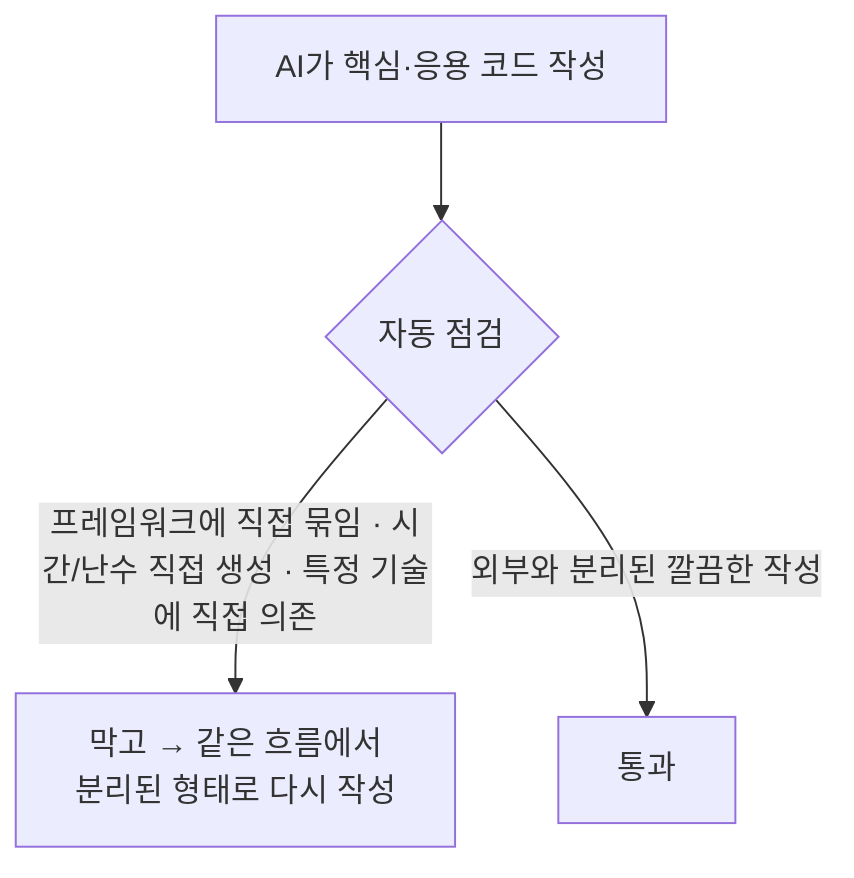
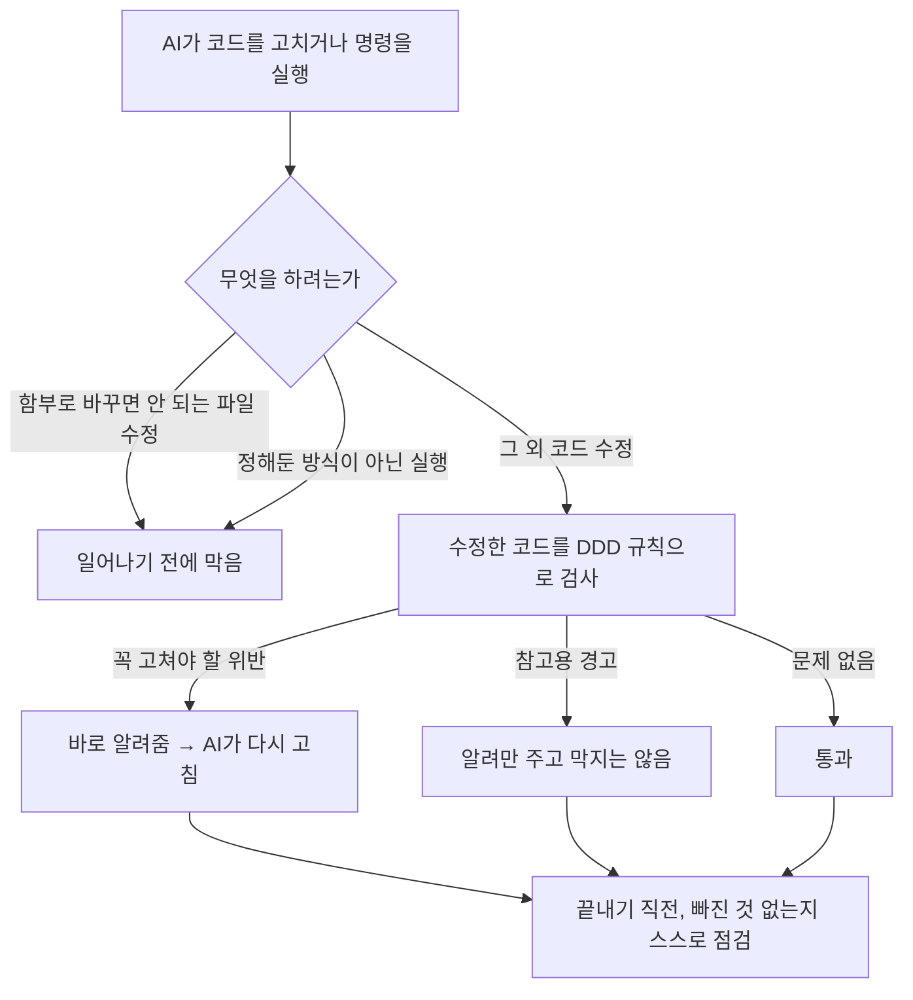
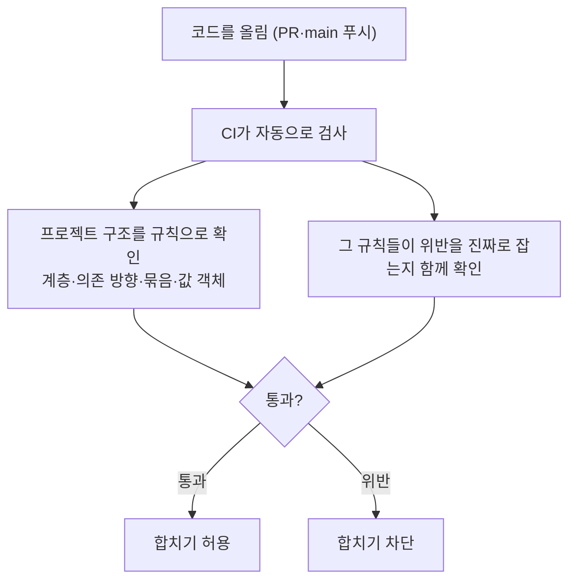
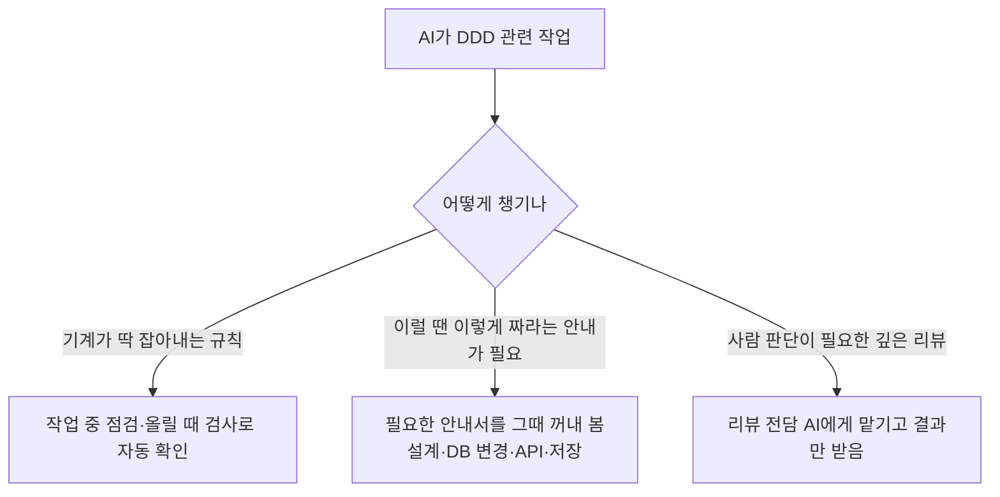
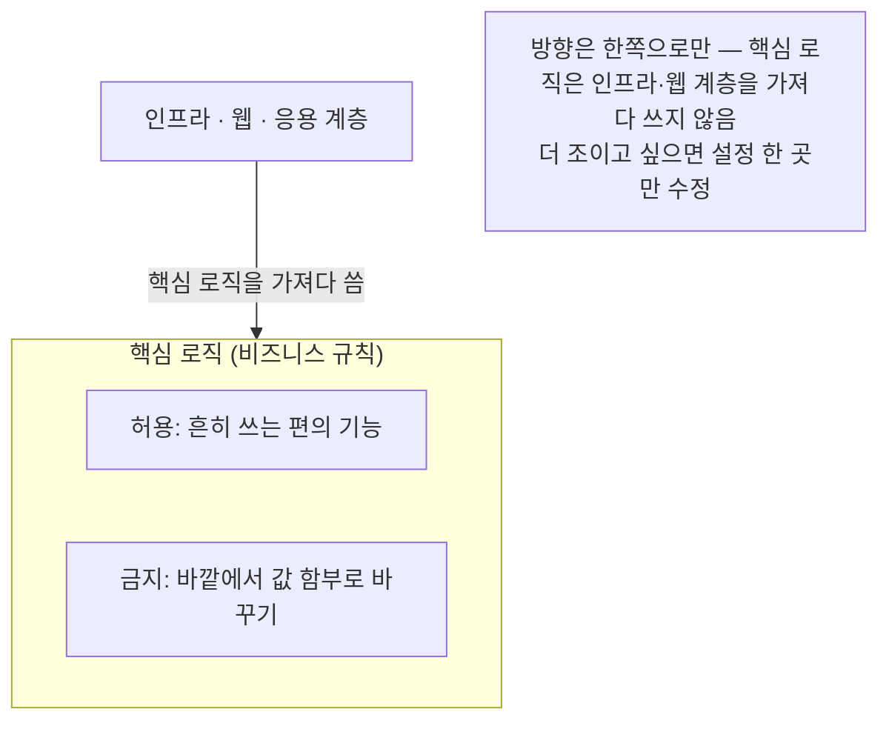

# opinionated-harness-template

AI 에이전트가 짜는 Java/Spring 코드를 DDD(도메인 주도 설계) 원칙에 맞게 잡아주는 가드레일 템플릿이에요. 사람이 매번 리뷰로 걸러내지 않아도, 정해둔 설계 규칙을 벗어나면 그 자리에서 짚어줘요.

변경 사항은 아래 릴리스 노트에서 확인할 수 있어요.

 
 

## 릴리스 노트

### v0.2.0

`2026년 6월 7일` · 자주 쓰는 흐름 묶기 · 외부 도구 연결 · 역할 정리

규칙으로 *막기만* 하던 데서 한 걸음 더 나아갔어요. 반복되는 작업을 명령 하나로 묶고, 필요할 때 외부 도구를 안전하게 붙이고, 각 장치가 무슨 역할을 하는지 문서로 갈래를 잡았어요.

  

**`새 기능`  자주 쓰는 흐름을 명령으로 (슬래시 커맨드 3종)**

새 코드를 찍어내는 도구가 아니에요. 이미 있는 점검·수정·검증 장치를 순서대로 엮어주는 흐름이에요.

- `/ddd-review` — 바뀐 부분만 골라 검토하고, 규칙을 벗어난 곳 목록만 돌려줘요.
- `/ddd-fix` — 벗어난 곳을 한 번에 하나씩 작게 고친 뒤 다시 확인해요.
- `/verify` — 점검을 한꺼번에 돌리고 결과를 있는 그대로 보여줘요.

  

**`새 기능`  외부 도구 안전하게 붙이기 (선택)**

AI가 필요할 때 외부 도구나 데이터를 참고하게 해줘요. 기본 예시로는 데이터베이스 구조를 '읽기 전용'으로만 보도록 넣어, 저장 관련 작업을 할 때 실제 구조를 보고 판단하게 했어요.

- 접속 정보는 환경변수로만 넣어요. 비밀번호 같은 값을 코드에 직접 적는 건 금지예요.
- 기본은 꺼진 상태라, 쓰겠다고 켤 때만 동작해요. 안 쓰면 그냥 빼면 되고, 빼도 나머지 점검은 멀쩡히 돌아가요.

  

**`새 기능`  역할 정리 + 참고 사례**

장치를 두 갈래로 나눠 정리했어요. 하나는 *AI가 무엇을 보고 판단하는가*(기본 지침·참고 안내서·리뷰 도우미), 다른 하나는 *AI가 무엇을 할 수 있고 무엇이 검증하는가*(작업 중 점검·외부 도구·올릴 때 검사). 슬래시 커맨드는 이 둘을 잇는 자리에 있어요.

이미 검증된 공개 사례들을 참고하되, 점검 규칙은 DDD에 맞게 새로 짰어요. 더 자세한 정리는 [`docs/HARNESS.md`](docs/HARNESS.md)에 있어요.

  

### v0.1.1

`2026년 5월 30일` · 핵심 로직을 외부에서 더 깔끔히 떼어내기

자동으로 잡아주는 설계 원칙을 16개에서 18개로 늘렸어요. AI가 흔히 따라 짜는 익숙하지만 좋지 않은 습관을, 그 자리에서 막아 돌려줘요.

  

**`개선`  핵심 로직을 프레임워크에서 분리**

비즈니스 규칙을 담는 부분이 특정 프레임워크 장치에 얽히지 않게 막아요. 그래야 그 부분만 따로 떼어, 무거운 환경 없이 빠르게 검증할 수 있어요.

  

**`개선`  기술이 바뀌어도 흔들리지 않게**

핵심·응용 코드가 특정 데이터베이스나 외부 연동 도구에 직접 달라붙지 않게 해요. 나중에 기술을 갈아끼워도(예: 저장소 종류 변경) 핵심 로직은 그대로 남아요.

  

**`개선`  테스트하기 쉬운 구조**

시간이나 난수처럼 실행할 때마다 값이 달라지는 것을, 핵심 로직이 직접 만들지 않게 해요. 같은 입력이면 늘 같은 결과가 나오니, 검증이 한결 수월해져요.

  

### v0.1.0

`2026년 5월 27일` · 첫 공개 릴리스

작업 중(내 컴퓨터)과 올릴 때(CI), 두 곳에서 DDD 위반을 잡는 첫 버전이에요. 파일 몇 개를 프로젝트에 복사하고 설정 몇 줄만 고치면 바로 써요.

  

**`새 기능`  작업 중 자동 점검**

AI가 파일을 고치는 순간, 코드를 읽고 벗어난 곳을 짚어줘요. 어기면 메시지를 돌려주고, AI는 같은 흐름에서 스스로 고쳐요. 사람이 매번 리뷰로 잡지 않아도 되는 거죠.

- 핵심 로직이 바깥 영역을 끌어다 쓰거나, 캡슐화를 깨거나, 값을 함부로 바꿀 수 있게 열어두면 짚어줘요.
- 묶음(애그리거트) 경계를 넘나드는 참조 같은 건 '경고'로만 알려줘요. 잘못 짚을 여지가 있어 막지는 않아요.
- 함부로 바꾸면 안 되는 파일을 건드리거나 정해둔 방식이 아닌 실행은, 일어나기 전에 막아요.
- 작업을 끝내기 직전엔 빠진 게 없는지 한 번 점검하게 해요.

  

**`새 기능`  올릴 때 구조 검사 (CI)**

코드를 올리면 CI가 프로젝트 전체 구조를 한 번 더 확인해요. 계층이 흐르는 방향, 묶음 경계, 값 객체 규칙 등 모두 10가지를 봐요. 한 파일만 봐선 안 보이는 구조 문제나, 작업 중 점검을 거치지 않은 변경이 여기서 걸려요.

규칙이 정말로 위반을 잡아내는지까지 함께 확인해 둬서, 검사 자체를 믿고 쓸 수 있어요.

  

**`새 기능`  설계 의도를 표시하는 6가지 표식**

도메인 모델에 "이건 묶음의 대표", "이건 값 그 자체", "이건 일어난 사건"처럼 역할을 표식으로 달아둬요. 그러면 점검 장치가 같은 기준으로 규칙을 확인해요. 여섯 가지는 이런 역할이에요.

- **묶음의 대표** — 바깥에서는 항상 이걸 거쳐서만 다뤄요.
- **묶음 안 부품** — 대표를 통해서만 만들어지고, 바깥에서 직접 못 건드려요.
- **값 그 자체** — 한번 만들면 바뀌지 않아요.
- **일어난 사건** — 과거형으로 이름 짓고, 만든 뒤엔 바뀌지 않아요.
- **계산 규칙 모음** — 한 객체에 담기 애매한 규칙을, 자기 상태 없이 입력으로만 처리해요.
- **서브도메인 분류** — 무엇이 우리 서비스의 *핵심*이고 무엇이 *보조·범용*인지 표시해요. 핵심이 범용 영역에 끌려가지 않도록 검사가 지켜줘요.

  

**`새 기능`  안내서와 리뷰 도우미**

AI가 필요할 때 꺼내 보는 안내서 4종(설계 원칙 · DB 변경 · API · 저장)을 넣었어요. 자동으로 딱 잘라 판정하기 어려운 영역은, 리뷰 전담 AI에게 맡겨요.

  

**`정책`  너무 빡빡하지 않게 (실용적 선택)**

핵심 로직 부분에서 흔히 쓰는 편의 기능은 허용하고, 바깥에서 값을 함부로 바꾸게 여는 것만 막아요. 더 엄격하게 조이고 싶으면 설정 파일 한 곳만 고치면 돼요.

  

**`참고`  알아두면 좋은 점**

- 작업 중 점검은 '처음 쓰는 순간'까지 막지는 못해요. 벗어난 걸 돌려줘 다음 차례에 고치게 해요. 사람이 직접 쓴 코드는 올릴 때 검사가 받쳐줘요.
- 경고 규칙은 더러 잘못 짚거나 놓칠 수 있어, 기본을 경고로만 뒀어요.
- 사람의 맥락 판단이 필요한 원칙(약 10가지)은 자동 검사 대신 리뷰 도우미에게 맡겨요. 억지로 흉내 내지 않았어요.
- 올릴 때 하는 구조 검사는 프로젝트 빌드에 연결해야 동작해요.

  

준비물은 작업 중 점검에 Node.js, 올릴 때 검사에 JDK 21 이상이에요.
쓰는 법은 [`docs/HARNESS.md`](docs/HARNESS.md), 구조 검사 연결은 [`docs/ARCHUNIT.md`](docs/ARCHUNIT.md)에 정리해 뒀어요.
